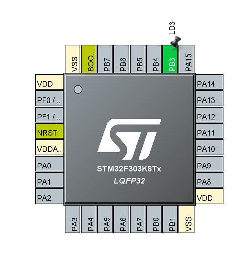

# 演習1 Lチカ

この演習ではマイコンプログラミングの第一歩である，LEDの点消灯，所謂Lチカを行う．


## CubeMXでの設定

CubeMXを起動し，Nucleo32f303k8を選択後，次の操作でピンの割り当てを行う．

1. PB3で左クリックで[GPIO_Output]を選択
2. 右クリックで[Enter User Label]を選択し，任意の名前を入力する（今回はLD3とした）
   



次に上部の[Clock Configuation]を選択し，HCLKを[64]に設定．

最後に上部の[Project Manager]を選択し，
- [Project Name]を任意の名前に設定
- 生成されるプロジェクトの場所を変更したい場合は，[Project Location]で変更
- [ToolChain / IDE]で[SW4STM32]を選択

これらの処理が終われば，右上の[GENERATE CODE]をクリックする．

## SW4STM32でのコーディング

SW4STM32で，CubeMXによって生成された初期コードを元にコーディングを行っていく．

まず初めに，先ほど設定したLD3ピンの初期化コードを確認する．
```c :main.c
/**
 * @brief GPIO Initialization Function
 * @param None
 * @retval None
 */
static void MX_GPIO_Init(void)
{
	GPIO_InitTypeDef GPIO_InitStruct = {0};

	/* GPIO Ports Clock Enable */
	__HAL_RCC_GPIOB_CLK_ENABLE();

	/*Configure GPIO pin Output Level */
	HAL_GPIO_WritePin(LD3_GPIO_Port, LD3_Pin, GPIO_PIN_RESET);

	/*Configure GPIO pin : LD3_Pin */
	GPIO_InitStruct.Pin = LD3_Pin;
	GPIO_InitStruct.Mode = GPIO_MODE_OUTPUT_PP;
	GPIO_InitStruct.Pull = GPIO_NOPULL;
	GPIO_InitStruct.Speed = GPIO_SPEED_FREQ_LOW;
	HAL_GPIO_Init(LD3_GPIO_Port, &GPIO_InitStruct);

}
```

GPIOポートへのクロック供給や設定が行われていることが分かる．

次にmain関数を見ていく．

```c : main.c
/**
 * @brief  The application entry point.
 * @retval int
 */
int main(void)
{
	/* USER CODE BEGIN 1 */

	/* USER CODE END 1 */


	/* MCU Configuration--------------------------------------------------------*/

	/* Reset of all peripherals, Initializes the Flash interface and the Systick. */
	HAL_Init();

	/* USER CODE BEGIN Init */

	/* USER CODE END Init */

	/* Configure the system clock */
	SystemClock_Config();

	/* USER CODE BEGIN SysInit */

	/* USER CODE END SysInit */

	/* Initialize all configured peripherals */
	MX_GPIO_Init();
	/* USER CODE BEGIN 2 */

	/* USER CODE END 2 */

	/* Infinite loop */
	/* USER CODE BEGIN WHILE */
	while (1)
	{
		/* USER CODE END WHILE */

		/* USER CODE BEGIN 3 */
	}
	/* USER CODE END 3 */
}
```

ペリフェラルの初期化，システムクロックの設定が行われ，次に先ほどのGPIO設定関数が呼ばれていることが分かる．

その後，次の無限ループが呼び出される．

```c
/* Infinite loop */
/* USER CODE BEGIN WHILE */
while (1)
{
	/* USER CODE END WHILE */
	/* USER CODE BEGIN 3 */
}
/* USER CODE END 3 */
```

この無限ループ内に処理を書くことで，周期的な処理を電源が切れる等するまで繰り返すことができる．また，コード内に

```c
/* USER CODE BEGIN Hoge */

/* USER CODE END Hoge */
```

のようなコメントが散見されるが，我々がコードを書く際はこの```BEGIN~END```間に書くことを忘れないでほしい．

この範囲外に書いた場合，ビルドや書き込みには問題は出ないが，CubeMXのピン設定に立ち戻り，[GENERATE CODE]し直した際には消える．

```c
/* USER CODE BEGIN Hoge */
SugoiFunction(); ←消えない
/* USER CODE END Hoge */
YabaiFunction(); ←消える
```


今回のLチカであるが，GPIO_Outputに割り当てたピンに3.3V又は0Vを出力する関数である```HAL_GPIO_WritePin```と，任意のミリ秒処理を遅らせる```HAL_Delay```で実装することができる．


```HAL_GPIO_WritePin```は次のように定義されている．

```c
void HAL_GPIO_WritePin(GPIO_TypeDef* GPIOx, uint16_t GPIO_Pin, GPIO_PinState PinState)
```

今回のLD3ピンの場合，

```c
HAL_GPIO_WritePin(LD3_GPIO_Port, LD3_Pin, GPIO_PIN_SET);
```

でHigh，つまりLD3を点灯，

```c :
HAL_GPIO_WritePin(LD3_GPIO_Port, LD3_Pin, GPIO_PIN_RESET);
```

でLow，つまりLD3を消灯することができる．

次に```HAL_Delay```であるが，

```c : 
/**
  * @brief  This function provides accurate delay (in milliseconds) based 
  *         on variable incremented.
  * @note   In the default implementation , SysTick timer is the source of time base. 
  *         It is used to generate interrupts at regular time intervals where uwTick
  *         is incremented.
  *         The function is declared as __Weak  to be overwritten  in case of other
  *         implementations  in user file.
  * @param  Delay specifies the delay time length, in milliseconds.
  * @retval None
  */
__weak void HAL_Delay(uint32_t Delay)
```

と定義されており，引数に与えた数値[ms]処理を中断する．つまり

```c
HAL_Delay(1000);
```

で，1秒間処理を待機できる．尚，装飾子```__weak```についてはのちほど解説する(@noteに書いてあるが)．

コーディングを終えた際は左上の金槌？のマークでビルドし，エラーがなければPCとボード上のNucleo32をUSBケーブルで繋ぎ，[プロジェクト名を右クリック]→[Run As]→[AC6 STM32 C/C++ Application]でマイコンに書き込みを行える．

演習1での解説は以上である．

Lチカの処理を実装してください．

[実装例はこちら](./main.c)