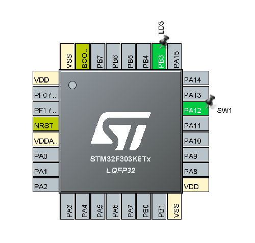

# 演習2 Lチカ with スイッチ

今回仕様する基板では，D2ピン，つまりPA12に赤色のSWが接続されている．


このようにスイッチが押された際に入力の電圧が落ちるように配線されている．

今回はこのスイッチが押されたときLDを点灯，押されていないとき消灯する処理系を作る．

## CubeMXの設定

前回同様，Nucleo32f303k8を選択してもよいが，演習1で用いたプロジェクトを[File]>[Save As]で保存する方が楽ではある(そうした)．

前述した通り，PA12にSWが接続されているので，

1. PA12を左クリックし[GPIO_Input]に設定
2. 右クリックで[Enter User Label]を選択し，任意のラベルを入力(SW1とした)



設定が完了したら[GENERATE CODE]で初期化コードを生成．

## SW4STM32でのコーディング

初期化コードを確認してみる．```MX_GPIO_Init```関数内で```SW1_Pin```が有効化されていることが分かる．

```c
/*Configure GPIO pin : SW1_Pin */
	GPIO_InitStruct.Pin = SW1_Pin;
	GPIO_InitStruct.Mode = GPIO_MODE_INPUT;
	GPIO_InitStruct.Pull = GPIO_NOPULL;
	HAL_GPIO_Init(SW1_GPIO_Port, &GPIO_InitStruct);
```

今回はGPIO割り込みを用いずに実装する(後でそっちもやります)．

GPIOからの入力値を得る```HAL_GPIO_ReadPin```関数を用いる．

```HAL_GPIO_ReadPin```は次のように記述されている(関数上で右クリック>[Open Declare]で関数の定義まで簡単に飛べます)．


```c
/**
  * @brief  Read the specified input port pin.
  * @param  GPIOx where x can be (A..F) to select the GPIO peripheral for STM32F3 family
  * @param  GPIO_Pin specifies the port bit to read.
  *         This parameter can be GPIO_PIN_x where x can be (0..15).
  * @retval The input port pin value.
  */
GPIO_PinState HAL_GPIO_ReadPin(GPIO_TypeDef* GPIOx, uint16_t GPIO_Pin){
```

今回の場合，次のような処理で値を得ることができる．

```c
int sw_val = HAL_GPIO_ReadPin(SW1_GPIO_Port , SW1_Pin );
```

演習2での解説は以上である．

今回はこのスイッチが押されたときLDを点灯，押されていないとき消灯する処理を作ってください．

[実装例はこちら](./main.c)