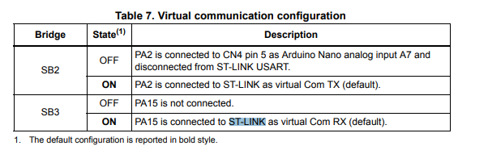
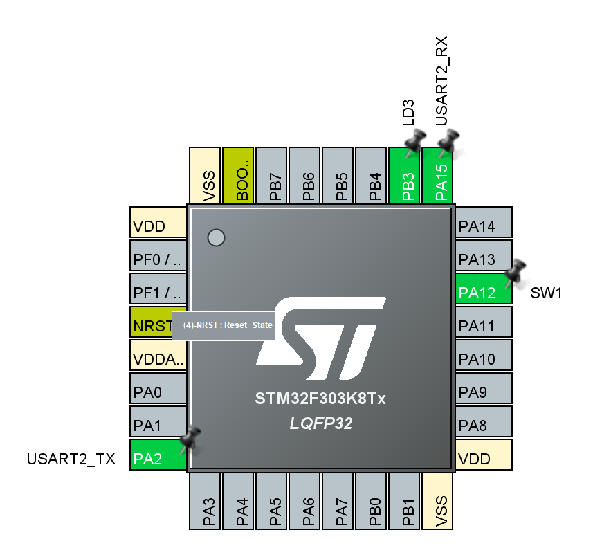

# 演習3 UART通信

この演習では，調歩通信方式であるUARTを用いて，PCと通信を行う．

## CubeMXの設定

下図より，PCとの接続に用いるmicro USB Type-Bポートは，PA15とPA2につながっていることが分かる．それに従いUSART通信のピンを設定する．



1. PA2を選択し，[USART2_TX]を選択
2. PA15を選択し，[USART2_RX]を選択
3. 左部のメニューより[Connectivity] > [USART2] > [Asynchronous]でUSARTを有効化する
4. 下部の[Parameter Setting]より[Baud Rate]を[115200]に設定



設定が完了したら[GENERATE CODE]で初期化コードを生成．

## SW4STM32でのコーディング
まず初期化コードの確認をしてみる
```c
/**
 * @brief USART2 Initialization Function
 * @param None
 * @retval None
 */
static void MX_USART2_UART_Init(void)
{

	/* USER CODE BEGIN USART2_Init 0 */

	/* USER CODE END USART2_Init 0 */

	/* USER CODE BEGIN USART2_Init 1 */

	/* USER CODE END USART2_Init 1 */
	huart2.Instance = USART2;
	huart2.Init.BaudRate = 115200;
	huart2.Init.WordLength = UART_WORDLENGTH_8B;
	huart2.Init.StopBits = UART_STOPBITS_1;
	huart2.Init.Parity = UART_PARITY_NONE;
	huart2.Init.Mode = UART_MODE_TX_RX;
	huart2.Init.HwFlowCtl = UART_HWCONTROL_NONE;
	huart2.Init.OverSampling = UART_OVERSAMPLING_16;
	huart2.Init.OneBitSampling = UART_ONE_BIT_SAMPLE_DISABLE;
	huart2.AdvancedInit.AdvFeatureInit = UART_ADVFEATURE_NO_INIT;
	if (HAL_UART_Init(&huart2) != HAL_OK)
	{
		Error_Handler();
	}
	/* USER CODE BEGIN USART2_Init 2 */

	/* USER CODE END USART2_Init 2 */

}
```

Baud Rate等が設定されていることが分かる．

UART通信の例を示す．
今回の場合，次のようなコードで，配列bufの長さ分の文字列を受け取ることができる．
4つ目の引数は待ち時間で，何も入力されなくても0xFFFFミリ秒は受信を続ける．

```c
HAL_UART_Receive( &huart2 , buf , sizeof(buf) , 0xFFFF );
```

送信の場合は次のように記述することで可能である．
```c
HAL_UART_Transmit( &huart2 , buf , sizeof(buf) , 0xFFFF );
```

演習3の解説は以上です．

PCのターミナルから入力を受け取り，そのまま返すプログラムを実装してください．

[実装例はこちら](./main.c)]