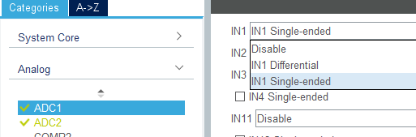
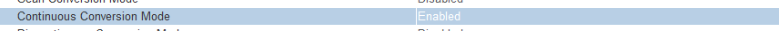
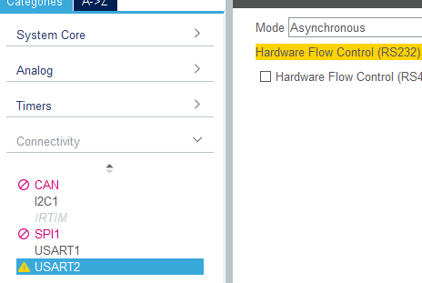
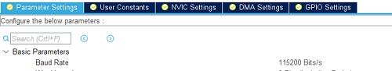
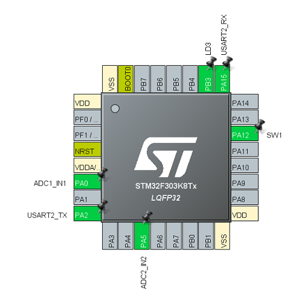

# 演習4 ADCとUART

今回はピンからの入力電圧を連続値(アナログ)で受け取るためのペリフェラル，Analog Digital Converter:ADCと，調歩通信方式であるUARTを用いて，
Nucleoで取得したセンサの値をPCのターミナル上で表示する．

## CubeMXでの設定

### ADCの設定

今回仕様する基板ではA0ピン，つまりPA0ピンに温度センサ，A4ピン(PA5)に照度センサが接続されている．
左のタブから
- [Analog]>[ADC1]を選択し，[IN1]を[IN1 Single-ended]
- [Analog]>[ADC2]を選択し，[IN2]を[IN2 Single-ended]

と選択することで有効化することができる．



また，設定で[Continuous Conversion]を[Enable]にすること(忘れると一度値を取ったまま，次ADC_Startが実行されるまで動かない)


### UARTの設定

NucleoについているUSB TypeBポートとSTM32のUARTペリフェラルは接続されており，

1. PA2を[USART2_TX]に設定
2. PA15を[USART2_RX]に設定
3. 左のタブから[Connectivity]>[Mode]で[Asynchronous]を選択



4. 下部の[Parameter Setting]より[Baud Rate]を[115200]に設定（今回はしてもしなくてもよい）



することでUSB TypeBケーブル経由でPCとUSART通信を行うことができる．


最終的なピン割り当てはこの通り



確認できたら[GENERATE CODE]する．

## SW4STM32でのコーディング


### ADCの値取得

ADCの値の取得はGPIOのようにワンラインではできない．
```HAL_ADCEx_Calibration_Start```でキャリブレーション，```HAL_ADC_Start```でADCのスタートを行い，
```HAL_ADC_PollForConversion```で変換終了を確認してから```HAL_ADC_GetValue```で値を受け取らなければ，適切な値を受け取れない．

次のコードはHALハンドルが```hadc1```のADCチャンネルでの値取得の例である．

```c
HAL_ADCEx_Calibration_Start(&hadc1, ADC_SINGLE_ENDED);
HAL_ADC_Start(&hadc1);
int adc1_val = 0;
while(1){
    if( HAL_ADC_PollForConversion(&hadc1 , 10 ) )
	    adc1_val = HAL_ADC_GetValue(&hadc1);
}
HAL_ADC_Stop(&hadc1);
```

### UARTでの送信

UARTでの送信は```HAL_UART_Transmit```で行う．

```c
/**
  * @brief Send an amount of data in blocking mode.
  * @note   When UART parity is not enabled (PCE = 0), and Word Length is configured to 9 bits (M1-M0 = 01),
  *         the sent data is handled as a set of u16. In this case, Size must indicate the number
  *         of u16 provided through pData.
  * @param huart   UART handle.
  * @param pData   Pointer to data buffer (u8 or u16 data elements).
  * @param Size    Amount of data elements (u8 or u16) to be sent.
  * @param Timeout Timeout duration.
  * @retval HAL status
  */
HAL_StatusTypeDef HAL_UART_Transmit(UART_HandleTypeDef *huart, uint8_t *pData, uint16_t Size, uint32_t Timeout)
```

今回の場合，次のように書くことで文字列bufを送信できる．

```c
// huart2に割り当てられたハンドルでアドレスbufからsizeof(buf)バイトのデータを送信する．送信完了待ち時間は0xFFFFミリ秒
HAL_UART_Transmit(&huart2, buf , sizeof(buf) , 0xFFFF );
```

演習3の解説は以上です．

温度センサと照度センサの値を受け取り，PCのコンソールに表示する処理を書いてください．

[実装例はこちら](./main.c)
