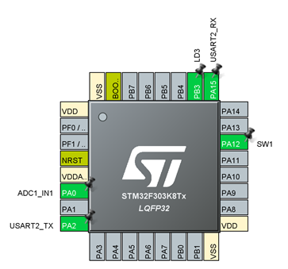

# 演習4 外部割り込み

前回の演習までのwhile文中に処理を書き，一定周期で特定処理を行うというプログラムは簡単なものであれば問題なく動くが，処理内容が重くなるとCPUリソースを無駄に浪費してしまい上手くいかないことも増える．

そういった問題を解決するキーワードとなるのが，今回の割り込みと[演習5](../lec05)で紹介するDMAである．

[演習2](../lec02)を思い出して欲しい．そこではwhile文の中でスイッチが押されているかを検知し処理を行っていた．
今回はGPIOに入力が来たとき検知するというEXTI割り込みという機能を用いてその処理をスマートに書く．

## CubeMXでの設定

1. P12を右クリックし[GPIO_EXTI12]に設定
2. P12を左クリックし[Enter User Label]で任意のラベルを入力．（今回はSW1とした）
3. 次に[System Core] > [NVIC]を開き，[EXTI line15:10] interrupts]にチェックマークを入れる

1. [System Core] > [GPIO]で[PA12]を選択し，[GPIO Mode]を[External Interrupt Mode with Rising/Falling edge trigger detection]を選択
   
   これは立ち上がり，立下りの両方を検知するという意味である．

最終的なピン配置は次の通りである．



## SW4STM32でのコーディング

まずは，初期化コードの確認．```MX_GPIO_Init```内でSW1が次のように設定されている．

```c
/*Configure GPIO pin : SW1_Pin */
	GPIO_InitStruct.Pin = SW1_Pin;
	GPIO_InitStruct.Mode = GPIO_MODE_IT_RISING_FALLING;
	GPIO_InitStruct.Pull = GPIO_NOPULL;
	HAL_GPIO_Init(SW1_GPIO_Port, &GPIO_InitStruct);
```

また，同関数内で次のように割り込みに関して設定されていることが分かる．
```c
/* EXTI interrupt init*/
    HAL_NVIC_SetPriority(EXTI15_10_IRQn, 0, 0);
    HAL_NVIC_EnableIRQ(EXTI15_10_IRQn);
```

実際にエッジを検出した際は，```src/stm32f3xx_it.c```内の```EXTI15_10_IRQHandler```が呼び出される．

```c
void EXTI15_10_IRQHandler(void)
{
	/* USER CODE BEGIN EXTI15_10_IRQn 0 */

	/* USER CODE END EXTI15_10_IRQn 0 */
	HAL_GPIO_EXTI_IRQHandler(GPIO_PIN_12);
	/* USER CODE BEGIN EXTI15_10_IRQn 1 */

	/* USER CODE END EXTI15_10_IRQn 1 */
}
```

この関数内に割り込み時の処理を書いても良いが，```HAL_GPIO_EXTI_IRQHandler(GPIO_PIN_12);```で何が行わているかをまず確認する．

```c
/**
 * @brief  Handle EXTI interrupt request.
 * @param  GPIO_Pin Specifies the port pin connected to corresponding EXTI line.
 * @retval None
 */
void HAL_GPIO_EXTI_IRQHandler(uint16_t GPIO_Pin)
{
	/* EXTI line interrupt detected */
	if(__HAL_GPIO_EXTI_GET_IT(GPIO_Pin) != 0x00u)
	{
		__HAL_GPIO_EXTI_CLEAR_IT(GPIO_Pin);
		HAL_GPIO_EXTI_Callback(GPIO_Pin);
	}
}
```

この関数では，入力の```GPIO_Pin```で実際に割り込みが発生したかを```if(__HAL_GPIO_EXTI_GET_IT(GPIO_Pin) != 0x00u)```で調べ，
発生した場合，```__HAL_GPIO_EXTI_CLEAR_IT(GPIO_Pin);```で割り込み検知レジスタを初期化後，コールバック関数```HAL_GPIO_EXTI_Callback(GPIO_Pin);```を呼び出している．

```HAL_GPIO_EXTI_Callback```を見てみる．

```c
/**
 * @brief  EXTI line detection callback.
 * @param  GPIO_Pin Specifies the port pin connected to corresponding EXTI line.
 * @retval None
 */
__weak void HAL_GPIO_EXTI_Callback(uint16_t GPIO_Pin)
{
	/* Prevent unused argument(s) compilation warning */
	UNUSED(GPIO_Pin);

	/* NOTE: This function should not be modified, when the callback is needed,
           the HAL_GPIO_EXTI_Callback could be implemented in the user file
	 */
}
```

この処理では特に何も処理を行っていないことが分かる．
この関数も[演習1](../lec01)で紹介した，```HAL_Delay```同様，装飾子```__weak```がついていることが分かる．

この```__weak```がついている関数はついてない関数よりも優先度が低く，コンパイル時に```__weak```がついている関数とついていない関数が存在する場合，<u>ついていない関数が優先される</u>．つまり，

```c
__weak void hoge(){
    printf("fuga!")
}

void hoge(){
    printf("piyo!")
}
```

をコンパイルした場合，関数```hoge```は```piyo!```と表示する関数となる．

今回はこの性質を用い，```main.c```内に```void HAL_GPIO_EXTI_Callback(uint16_t GPIO_Pin)```を宣言し，そこに割り込みの処理を書く．

演習4の解説は以上です．

GPIO割り込みを用いて演習2同様にSW1押しているとき間LD3が点灯し，離すと消灯するプログラムを作成してください．

また，PA8も同様に[GPIO_EXTI]を有効化し，SW2とし，
SW1とSW2ともに[External Interrupt Mode with Falling edge trigger detection]（立下り検知）とし，

- SW1が押されたとき+1
- SW2が押されたとき-1
- どちらが押されてもカウンターの値をターミナル表示

というプログラムを作成してください．

[実装例はこちら](./main.c)