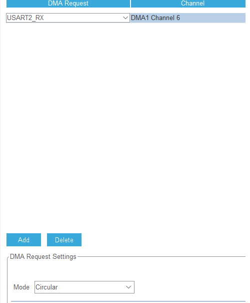

# 演習6 Direct Memory Access : DMA

この演習ではDirect Memory Access : DMAについて取り扱う．

DMAは簡潔に言えばCPUを用いない送受信の手法であり，UARTでの受信を例に上げると，通常の受信では

1. CPUがペリフェラルからReadし，レジスタに格納
2. レジスタに取得した値をCPUがメモリに格納

という順で処理されるが，DMAを用いた場合，

0. (DMAの設定)
1. ペリフェラルから入力を確認したDMACが，メモリへそのまま格納

とCPUを介さずに処理することができる．これにより，CPUは送受信にリソースを割くことなく演算に集中できるという恩恵が得られる．
データが垂れ流されているのを受信し，編集して送信といった処理であれば必須の処理とも言える．

今回はそんなDMAを用いて，PCからの入力を受信し，半分埋まるごとにPCに送信という処理を作成する．

## CubeMXでの設定

1. 左部[Connectivity]>[USART2]の[DMA Settings]をクリック
2. 下部の[Add]をクリックし，[USART2_RX]を選択
3. 下部の[Mode]で[Circular]を選択



## SW4STM32でのコーディング

まず初めに確認して貰いたい点が，```main```関数内の```/* Initialize all configured peripherals */```だ．

このコードは自動生成されるコードだが，DMAを初期化する関数である```MX_DMA_Init();```が，UARTを初期化する関数```MX_USART2_UART_Init();```より前に実行されるようになっているかを確認して貰いたい．
DMAの初期化はそれを用いるペリフェラルの初期化より前に実行されるのが規定であるが，ときおり逆になっていることがある．バグ報告はしたが，改善されるまでは手で直すしかない．

DMAを用いたUARTの受信関数```HAL_UART_Receive_DMA```について紹介する．この関数は今回の場合，次のようにすることでDMAを用いた受信を実行することができる．

```c
uint8_t buf[BUF_SIZE];
HAL_UART_Receive_DMA( &huart2 , (uint8_t *)buf , sizeof(buf));
```

Modeを[Circular]にしている場合，受信サイズを受け取った際にまた先頭からデータを入力していくため，エラー等が起きない限りは受信し続ける．

DMAを用いた処理には多くの場合割り込み設定が可能であり，```HAL_UART_Receive_DMA```も割り込み設定が可能である．この関数の定義を見てみると，

```c
	  /* Set the UART DMA transfer complete callback */
      huart->hdmarx->XferCpltCallback = UART_DMAReceiveCplt;

      /* Set the UART DMA Half transfer complete callback */
      huart->hdmarx->XferHalfCpltCallback = UART_DMARxHalfCplt;

      /* Set the DMA error callback */
      huart->hdmarx->XferErrorCallback = UART_DMAError;

      /* Set the DMA abort callback */
      huart->hdmarx->XferAbortCallback = NULL;
```

このように割り込み関数を割り当てているのが確認できる．更に完了割り込みである```UART_DMAReceiveCplt```の定義を見てみるとコールバック関数を呼び出していることが確認できる．

```c
/*Call legacy weak Rx complete callback*/
	HAL_UART_RxCpltCallback(huart);
```

この```HAL_UART_RxCpltCallback(huart);```であるが，記載通り定義は```__weak```修飾子が用いられており，

```c
/**
  * @brief  Rx Transfer completed callback.
  * @param  huart UART handle.
  * @retval None
  */
__weak void HAL_UART_RxCpltCallback(UART_HandleTypeDef *huart)
{
	/* Prevent unused argument(s) compilation warning */
  	UNUSED(huart);

  	/* NOTE : This function should not be modified, when the callback is needed,
            the HAL_UART_RxCpltCallback can be implemented in the user file.
   	*/
}
```

```__weak```を消して再定義することで上書きすることができる．つまり，この```HAL_UART_RxCpltCallback```を用いてDMA完了時に割り込みを発生させ特定の処理ができる．

この割り込みを用いて，メモリが埋まるごとに```HAL_UART_Transmit```でPCのターミナルに出力する処理を書き，実行してください．

# 課題6

バッファが**半分**埋まるごとにPCに出力する処理を書き，実行してください．

ヒント：```UART_DMARxHalfCplt```の定義を追っていけば半分埋まった際のコールバック関数も分かる


[実装例はこちら](./main.c)